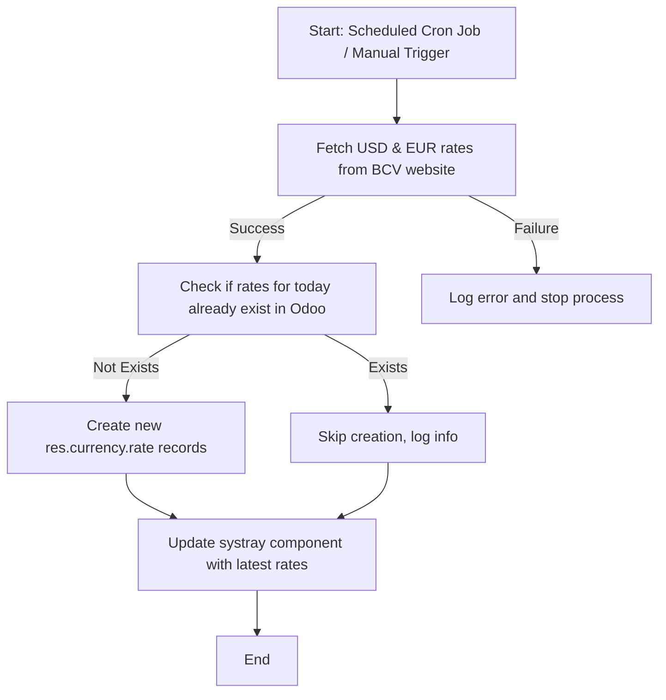

# BCV EXCHANGE RATE

## Purpose

This module provides real-time integration of the Central Bank of Venezuela (BCV) exchange rates into Odoo. It fetches the official USD and EUR rates daily and updates the corresponding currencies in Odoo. The module also adds a convenient systray indicator for quick access to current rates.

---

## Main Features

- **Automatic Exchange Rate Update**  
  Fetches USD and EUR rates from the BCV website and updates the corresponding currency rates in Odoo.

- **Systray Display**  
  Shows USD and EUR rates in the Odoo systray with 4 decimal precision. Clicking on a currency opens its form view.

- **Cron Job for Daily Updates**  
  Automatically updates rates every day using a scheduled cron job, ensuring the system always has the latest rates.

- **Inverse Rate Support**  
  Returns `inverse_company_rate` to align with Odoo's accounting conventions.

- **Base Currency Awareness**  
  Rates are displayed relative to the company’s base currency symbol.

## Technical Overview

The **BCV Exchange Rate** module integrates official exchange rates from the Central Bank of Venezuela (BCV) into Odoo. It ensures that USD and EUR currency rates are always up-to-date and provides a convenient systray indicator for quick reference. The module is designed to work seamlessly with Odoo’s currency management and supports daily automatic updates through a scheduled task.

---

## Core Functions

### 1. Fetch Exchange Rates from BCV
- Retrieves official USD and EUR exchange rates from the BCV website.
- Handles potential connection errors and logs any issues encountered during the fetch process.
- Returns the rates along with the current date.

### 2. Update Odoo Currency Rates
- Updates the `res.currency.rate` records for USD and EUR using the fetched rates.
- Checks if a rate for the current day already exists to avoid duplicate entries.
- Converts rates to `inverse_company_rate` to align with Odoo’s accounting conventions.
- Logs rate creation events for traceability.

### 3. Systray Integration
- Adds a systray component displaying current USD and EUR rates.
- Shows rates with four decimal precision, making them precise and easy to read.
- Clicking on a currency opens its corresponding form view for further inspection or editing.

### 4. Scheduled Updates (Cron Job)
- Runs daily to automatically fetch and update exchange rates.
- Ensures that the system always has the most recent official rates without manual intervention.
- Can be configured to adjust the interval for different business needs.

### 5. Company Awareness
- Rates are updated relative to the company’s base currency.
- Supports multi-company setups by associating rates with the correct company context.

### 6. Logging and Error Handling
- Any errors during fetching or updating are logged for troubleshooting.
- Prevents system failure in case the BCV website is temporarily unreachable.

---

## Process Flow

## Benefits

- **Reliable Exchange Rates:** Automatically fetches official USD and EUR rates from BCV.
- **Accuracy in Transactions:** Ensures financial operations use up-to-date rates.
- **Quick Reference:** Displays current rates directly in the Odoo systray for easy access.
- **Automation:** Reduces manual updates and potential human errors.
- **Multi-Company Support:** Associates rates with the correct company in multi-company setups.
- **Traceability:** Logs all updates and errors for auditing and troubleshooting.

## Usage

1. **Install the Module**
   - Add the module to your Odoo addons directory.
   - Update the apps list and install the module via Odoo interface.

2. **Automatic Exchange Rate Updates**
   - The module automatically fetches USD and EUR exchange rates from BCV every day.
   - Rates are stored in the system and linked to the current company.

3. **Systray Widget**
   - Once installed, a systray widget displays the current USD and EUR rates.
   - Click on each currency in the dropdown to open its detailed currency form view.

4. **Manual Update**
   - You can trigger a manual update of the exchange rates by executing the scheduled action or calling the `_update_exchange_rates()` method on `res.currency`.

5. **Multi-Company Support**
   - Rates are stored per company, ensuring correct values in multi-company environments.

6. **Error Logging**
   - Any errors during fetching of rates are logged for monitoring and troubleshooting purposes.

## Maintenance and Support

For maintenance and support, please contact [soltecferr](https://www.soltecferr.com), refer to the module's repository for updates and issue tracking, or send an email to gerferr83@soltecferr.com. 